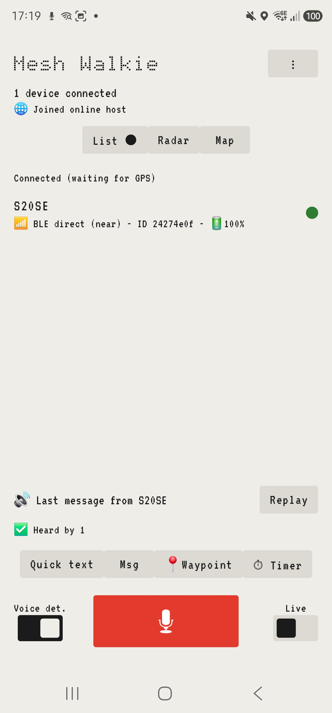
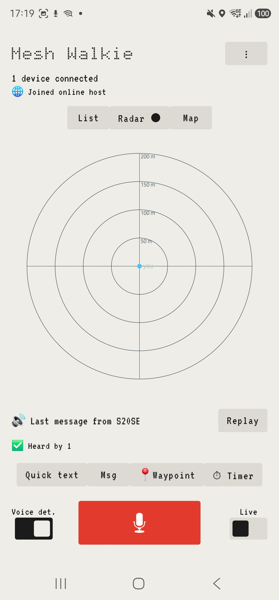
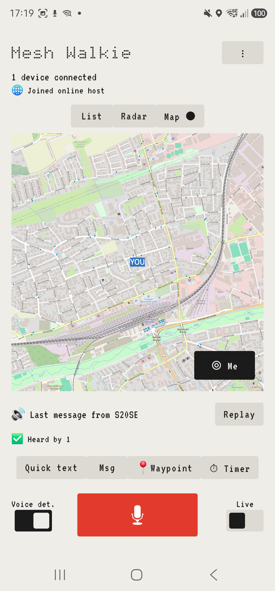
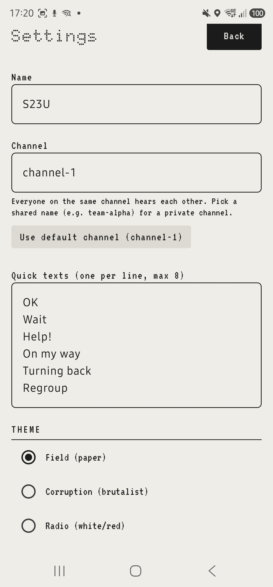
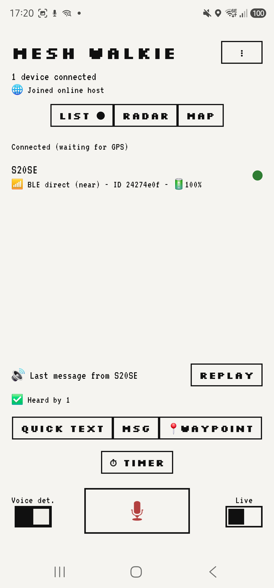
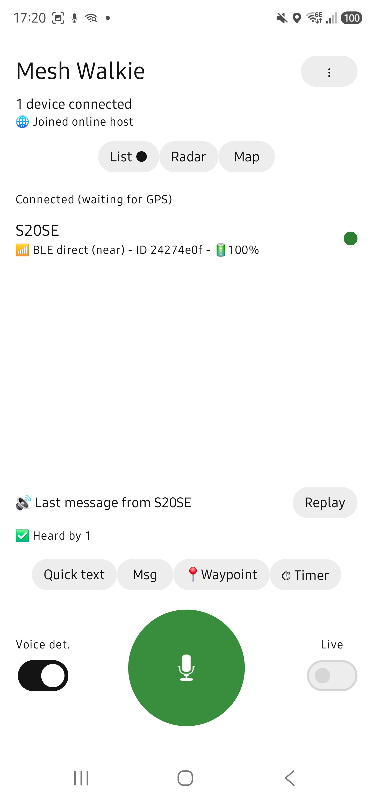
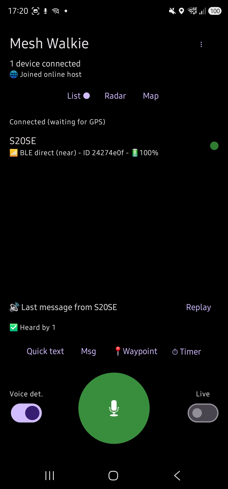
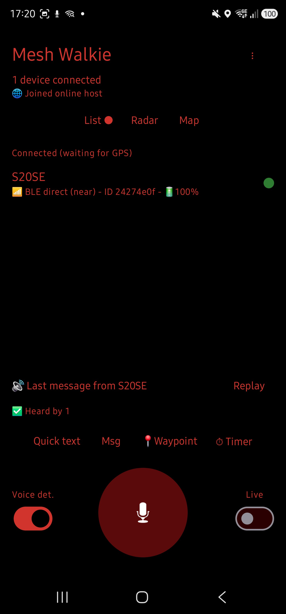

<div align="center">

# Mesh Walkie

### Turn your phone into a walkie-talkie. No signal, no SIM, no internet.


</div>

---

> Phones talk to each other **directly over Bluetooth**. Your voice hops from
> phone to phone, so the more people in the group, the further it reaches.
> Mountains, festivals, deep forest - anywhere with no signal.

## What it does

|  |  |
|---|---|
| **Talk** | Hold the button, your whole group hears you |
| **Live** | Stream your voice non-stop (works as a baby monitor) |
| **Find** | An arrow and distance to each friend, like `600 m N` |
| **See** | Map and radar of the whole group |
| **Type** | One-tap quick texts like `OK` or `On my way` |
| **Pin** | Drop a `meet here` marker on the map |
| **Reach** | Out of mesh range? An optional online relay bridges the group over the internet |

## See it

<div align="center">

<table>
<tr>
<td align="center"><br><sub><b>List</b> - who's on, how you reach them, battery</sub></td>
<td align="center"><br><sub><b>Radar</b> - range rings around you</sub></td>
<td align="center"><br><sub><b>Map</b> - the whole group, offline tiles</sub></td>
<td align="center"><br><sub><b>Settings</b> - channel, theme, quick texts</sub></td>
</tr>
</table>

<sub>Each peer shows whether you reach them 📶 over the Bluetooth mesh (with hop count) or 🌐 over the internet relay.</sub>

<br><br>

**Themes**

<table>
<tr>
<td align="center"><br><sub>Corruption</sub></td>
<td align="center"><br><sub>Radio</sub></td>
<td align="center"><br><sub>Dark</sub></td>
<td align="center"><br><sub>Night (red, dark-adapted)</sub></td>
</tr>
</table>

<sub>Default is <b>Field</b> (paper), shown above.</sub>

</div>

## How it works

**1.** Pick a shared channel name (your group's secret word)
**2.** Walk apart - phones link over Bluetooth on their own
**3.** Talk. Out of range? Your voice hops through phones in between.

## Private by design

Only phones with your channel name can hear you. Voice is encrypted
(AES-256-GCM). No accounts, no servers, nothing leaves the group.

## Settings

<details>
<summary><b>Every setting, explained</b></summary>

<br>

Open the **⋮ menu → Settings**. Changes save as you go (text fields save when you tap away or press Back).

| Setting | What it does |
|---|---|
| **Name** | Your display name, shown to everyone else in the group. |
| **Channel** | The group's shared secret word. Only phones on the same channel hear each other - pick a private one like `team-alpha`. Defaults to `channel-1`; a one-tap button resets to it. |
| **Quick texts** | Your one-tap message presets (up to 8, one per line), shown on the wheel next to the talk button. |
| **Theme** | Five looks: **Field** (paper, default), **Corruption** (brutalist), **Radio** (white/red), **Dark** (OLED black), **Night** (red, night-vision friendly). |
| **Share my GPS position** | Broadcast your location so friends get your arrow, distance, and map pin. Off = privacy, and the GPS chip is powered down (saves battery). |
| **Sound if a device goes offline** | Play an alert tone when someone drops off the mesh. |
| **Volume-down = push to talk** | Hold the volume-down button as PTT - eyes-free, glove-friendly. |
| **Mute all sounds** | Silence every alert beep *and* incoming voice playback. |
| **Text message sound** | Beep when a quick text or message arrives. |
| **Live: only stream when speaking** | In Live mode, drop silent/room-noise chunks and send only your voice. Off = continuous stream (e.g. baby monitor). Mirrors the **Voice det.** switch on the main screen. |
| **Bluetooth headset mic** | Capture your voice through a connected Bluetooth (SCO) headset instead of the phone mic. |
| **Hold to ear → earpiece** | Proximity sensor routes incoming voice to the earpiece when you raise the phone to your ear - for loud places. |
| **Auto level mic (AGC + limiter)** | Evens out quiet/loud and near/far speakers without clipping. Applied at your mic, so everyone hears you at a steady level. On by default. |
| **Voice quality (AMR-WB)** | Bitrate per clip: **Sparing** (12.65k), **Medium** (15.85k), **Best** (23.85k). Higher = clearer but more data; lower stretches weak or long links. |
| **Fallback via WiFi → Host** | Make this phone the LAN relay server (shares its IP on the mesh) so others extend range over a shared WiFi/hotspot. |
| **Fallback via WiFi → Client** | Auto-join a host announced on the mesh. |

**Online relay** (⋮ menu → **Servers**, separate from Settings): enter an internet relay address to bridge phones that aren't on the same mesh - `host:port` for a direct/LAN/VPS relay, or `wss://your-host` for one behind a Cloudflare Tunnel or similar. It reconnects on its own if the link drops. See [`server/README.md`](server/README.md).

The bottom of Settings shows your read-only **Device ID** and the installed **version**.

</details>

## Online relay (optional)

<details>
<summary><b>How the relay works, and how to run your own</b></summary>

<br>

Phones too far apart for the Bluetooth/WiFi mesh - different cities, no chain of phones between them - can bridge through a shared **internet relay**.

**How it works.** The relay is a blind forwarder. Every packet is already AES-256-GCM encrypted on the phone with your channel key, so the relay only ever sees ciphertext - it stores nothing, has no accounts, and just fans each packet out to every *other* phone connected to it. Whoever runs the box cannot read your voice, text, or position. It's one small Python file (standard library only, no dependencies), dual-protocol on a single port: **raw TCP** for direct/LAN/VPS use, and **WebSocket** so it can sit behind an HTTP-only tunnel. A phone connected to both the mesh and the relay bridges the two for free.

**Run it**

```bash
# plain Python 3 - no packages to install
python server/relay.py

# or Docker
cd server && docker compose up -d
```

Env vars: `PORT` (default `51820`), `MAX_CLIENTS` (default `64`).

**Make it reachable** - pick what fits your network:

| Situation | How |
|---|---|
| VPS / box with a public IP | Open the port, point the app at `your-host:51820` (raw TCP). |
| Home server behind a router | Forward the port to the box, then as above. |
| No public IP / CGNAT / firewall | Run a tunnel that dials outbound - nothing to forward. `cloudflared tunnel --url http://localhost:51820` prints a throwaway `https://xyz.trycloudflare.com`; use `wss://xyz.trycloudflare.com` in the app. For a permanent hostname use a named Cloudflare Tunnel or Tailscale Funnel. |

**Point the app at it.** On each phone: **⋮ menu → Servers → Online server**, enter the address - `host:port` for a raw relay, `wss://host` for one behind a tunnel - and tap **Connect**. It reconnects on its own (backoff up to 30s) if the link drops.

Full wire protocol, the `200 ok` health check, Docker + tunnel deployment notes, and an in-process self-test (`python server/test_relay.py`) are in [`server/README.md`](server/README.md).

</details>

## Get it

<div align="center">

### [Download the latest APK](https://github.com/pg0/mesh-walkie/releases/latest)

Allow *install from unknown sources*, then open and grant permissions.

</div>

---

<details>
<summary><b>For developers</b></summary>

<br>

Native Android (Kotlin, Jetpack Compose, foreground service). A pure-Kotlin core
(`com.meshwalkie.core`) is JVM-unit-tested; the Android layer wraps Google Nearby
Connections (BLE mesh) with an optional WiFi/LAN relay fallback.

| Area | Tech |
|---|---|
| Transport | Google Nearby Connections (P2P_CLUSTER, BLE), TTL + dedup flood |
| Voice | AMR-WB (MediaCodec), IMA ADPCM fallback, live chunk streaming |
| Crypto | AES-256-GCM channel key |
| Map | osmdroid (OpenStreetMap, no API key) |
| UI | Jetpack Compose |

```bash
# Build
gradlew.bat :app:assembleDebug

# Unit tests (pure JVM core)
gradlew.bat :app:testDebugUnitTest
```

Radio behaviour cannot be unit-tested; verify on 2-3 phones (same-room
discovery, arrows, PTT, multi-hop relay, freshness, screen-off). A signed
release needs a `keystore.properties` at the repo root pointing at your own
keystore; that file and all `*.jks` keys are gitignored and never committed.

**Online relay** - phones off the same mesh reach each other through a
standalone internet relay (blind ciphertext forwarding, no accounts, same
length-framed wire protocol as the phone-hosted relay). See
[`server/README.md`](server/README.md) for the protocol spec, how to run it
(plain Python or Docker), and deployment notes.

**Fonts** - the FIELD and CORRUPTION themes bundle Doto, VT323, and
Silkscreen (Google Fonts, SIL Open Font License) under
`app/src/main/res/font/` for their dot-matrix/pixel type scales. Licenses in
[`docs/font-licenses/`](docs/font-licenses/).

</details>
